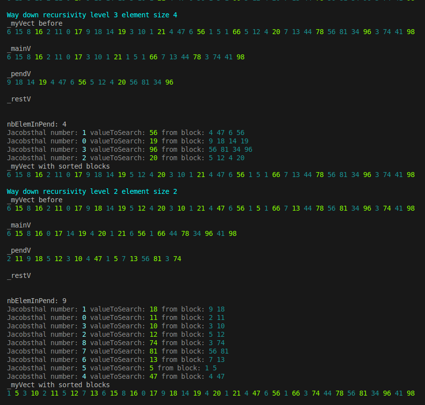

## CPP09/ex02 – Ford-Johnson Merge-insertion Algorithm

The goal of this exercise is to **sort a sequence of positive integers using the Ford-Johnson merge-insertion algorithm** and compare performance across different container types.

The Ford-Johnson algorithm (also known as merge-insertion sort) is a sorting algorithm that minimizes the number of comparisons needed to sort a sequence, making it theoretically optimal for small datasets.

[Beautiful piano to help to go through this algo 🎵🎹🎶](https://www.youtube.com/watch?v=rrby-2QnGZQ&list=RDSpQ8-xiDYWI&index=18)


### 🧩 Technical Skills

C++98 · STL containers (`std::vector`, `std::deque`) · Ford–Johnson merge-insertion sort · Performance benchmarking · Time complexity analysis · Large dataset handling


### Something interesting about this project

I like because it ask total focus, visualisation of sorting mechanics feels like magic, hard and challenging, dig into, 


./PmergeMe 2 11 0 17 8 16 6 15 3 10 1 21 9 18 14 19 5 12 4 20 7 13 78 44 1 66 5 1 4 47 56 6 3 74 41 98 96 34 81 56

To make visulisation better for other student, new class (to unhidde in main) ShowPmergeMe ShVectorDatas; to see every step of the project. 
how the algo work

the implementation and use of Jacobstahl number

Did you know Jacobstahl number was coming from baby rabbits? 🐇🐇🐇🐇🐇🐇

made some teste ./test.sh



### 🖥️ Compilation & Usage

```bash
$> make
$> ./PmergeMe "list of integers to sort"
$> ./PmergeMe 2 11 0 17 8 16 6 15 3 10 1 21 9 18 14 19 5 12 4 20 7 13
$> Before: 2 11 0 17 8 16 6 15 3 10 1 21 9 18 14 19 5 12 4 20 7 13
$> After: 0 1 2 3 4 5 6 7 8 9 10 11 12 13 14 15 16 17 18 19 20 21
$> Time to process a range of 22 with std::vector: 14 µs
$> Time to process a range of 22 with std::deque: 24 µs
$> ./PmergeMe `shuf -i 1-100000 -n 3000 | tr "\n" " "`
$> ...
$>./test.sh 

```

*Part of the C++ module series at 42 Lausanne*


